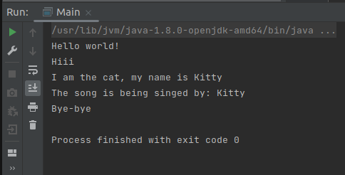

## Spring_moreSpringAnnotations_xml
<html></html>

Это маленький проект, использующий Spring Annotations.

(Продолжение проекта https://github.com/abambi-abambi/Spring_1stSpringAnnotation_xml)

	- откройте проект в IDEA, запустите с помощью alt + shift + F10
		(запуск проекта из IDEA).

	- вот какой вывод будет в терминале:

<html></html>

Объекты создавались с использованием Аннотаций в Спринге.

См. код и комментарии в файлах проекта (папка java/org/example, папка java/org/example/entities, папка resouces).

Проект использует и работает с:

	- OS: Linux (Ubuntu 21.04) 64-bits;
	- IDEA Community Edition;
	- Spring Framework;
	- Maven build tools;
	- Java 8 (JDK 1.8).

~*~ часть 1, разъяснения ~*~

Аннотации Spring Framework - это специальный тип комментариев.

Это инструкции / метаданные -> получение через рефлексию в "просто" java или использование их Spring Framework

Преимущества аннотаций (по сравнению с прописыванием <Bean> в .xml):

	- они короче, удобнее и делают код более читабельным

Spring сканирует все классы, ищет аннотации и автоматически создает Bean'ы.

	1. **@Component**
		Значение:
			- указание создать бин из помеченного класса. Пишется над именем класса.
		Виды:
			- без указания id (тогда id бина совпадает с названием класса, но с маленькой буквы);
			- с указанием id, по шаблону @Component("название_id_бина").

	2. **@Autowired**
		Куда внедрен:
			- поле (приватное);
			- конструктор, см.ниже;
			- сеттер (имя сеттера может быть неклассическим), см.ниже.
		(* ниже:  приходит или объект типа класс,
			или типа интерфейс (если только 1 класс его реализует))
		Кто внедряется:
			- объект класса, помеченного @Component;
		Сложности:
			- отсутствие подходящего бина;
			- присутствие 2-х и более подходящих бинов.

	3. **@Qualifier**
		Зачем нужен:
			- уточняет, какой класс (id бина) нужно брать 
				при использовании внедрения (@Autowired)
				(нужно при неоднозначности, множестве подходящих бинов).
		Где использовать:
			- в полях (+ выше - аннотация @Autowired);
			- конструкторах (+ выше - аннотация @Autowired);
			- сеттерах (+ выше - аннотация @Autowired).

	4. **@Scope**
			- "singleton" - объект создается единожды и однократно
				(+ выше - аннотация @Component);
			- "prototype" - создаются разные объекты того же класса
				(+ выше - аннотация @Component).
			(аннотация @Scope идет после аннотации @Component, добавляя доп.инфу)

	5. @Value
			- работает аналогично (как и связка .xml + <beans>) с использованием
				внешнего файла .properties 
		Синтаксис:
			- файл .properties (name=value на каждой строчке);
			- файл .xml, строка:
				<context:property-placeholder location="classpath:name_of_our_file.properties" />
			- над задействованной переменной строка: @Value("${valuename_from_file.properties}").

	6. @PostConstruct
			- работает аналогично init-method бинов;
			- указать эту аннотацию строчкой выше метода-"инициатора".

	7. @PreDestroy
			- работает аналогично destroy-method бинов;
			- указать эту аннотацию строчкой выше метода-"деструктора".

Вот 3 составляющие Аннотаций, на примере @Component:

	- в файле .xml наличие строчки: <context:component-scan base-package="org.example.entities" />
		(означает включение сканирования компонентов)
	- в классе, который поступит в контекст 
		(который иначе бы обрабатывался с помощью Bean) - наличие аннотации @Component
	- из main'а (в данном проекте) - вызов объекта из контекста
		через context.getBean (для какой-то работы с ним)

Кстати, для версии джава после Java 11:

 чтобы использовать @PostConstruct и @PreDestroy
	необходимо добавлять зависимость в pom.xlm

	<dependency>
		<groupId>javax.annotation</groupId>
		<artifactId>javax.annotation-api</artifactId>
		<version>1.3.2</version>
	</dependency>

~*~ часть 2, ссылки на материалы ~*~

Ссылки:

	Spring

	"Spring Framework. Урок 9: Аннотации. Введение."
	https://www.youtube.com/watch?v=aXDMYy930b4&list=PLAma_mKffTOR5o0WNHnY0mTjKxnCgSXrZ&index=10

	"Spring Framework. Урок 10: Аннотация @Autowired. Внедрение зависимостей (Dependency Injection)."
	https://www.youtube.com/watch?v=KvyD2Vg4b1Q&list=PLAma_mKffTOR5o0WNHnY0mTjKxnCgSXrZ&index=10

	"Spring Framework. Урок 11: Аннотация @Qualifier. Внедрение зависимостей (Dependency Injection)."
	https://www.youtube.com/watch?v=pDTzRsuGrDU&list=PLAma_mKffTOR5o0WNHnY0mTjKxnCgSXrZ&index=11

~*~ часть 3, дополнительно ~*~

Быстрые клавиши, IDEA:

	alt + insert: вызов меню автогенерации (конструкторов и т.п.);

	ps (напечатать в коде программы): дальше всплывает подсказка,
		что создать, например, метод main() - "psvm";

	alt + shift + F10: запуск проекта из IDEA

Tags: Spring, Application Context, Inversion of Control, Dependency Inversion, Beans, Annotations, Maven
